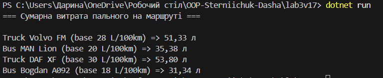

# ЛР3: Наслідування (варіант 17 — Машини)

**Мета:** закріпити базові/похідні класи, `base`, `abstract`/`virtual`/`override`, поліморфізм.  
**Завдання:** `Vehicle` → `Truck`, `Bus`; обчислити сумарне споживання пального на маршруті.

## Реалізація
- `Vehicle` — абстрактний базовий клас із `abstract FuelConsumption(...)`, виклик `base(...)` у конструкторах похідних.
- `Truck`, `Bus` — `sealed` класи з власними факторами витрат (на тонну та на пасажира).
- Поліморфізм: `List<Vehicle>` + виклик `FuelConsumption` для кожного сегмента маршруту.
- (Для демонстрації критеріїв) додано фіналізатор `~Vehicle()`.

## Приклад запуску

## Посилання
- Методичка: **«https://docs.google.com/document/d/15fiaV5sXbJlLSYNdB3PM98mtdFJUT1doBZiGW6Eanjg/edit?tab=t.0#heading=h.ha9nfjv4nyk4»**
- Варіант: **№17 (Машини: Vehicle → Truck, Bus; підрахунок сумарного споживання пального)**