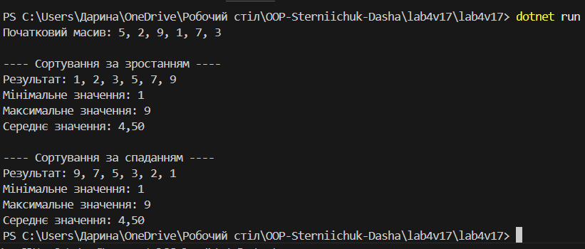

# Лабораторна робота №4
**Тема:** Абстракції та інтерфейси. Композиція та агрегація.  
**Виконав:** Стернійчук Дарина, група ІПЗ-3/2

## Мета роботи
Ознайомитися з використанням інтерфейсів та абстракцій у C#, навчитися застосовувати композицію для організації зв’язків між класами, а також реалізувати обчислення згідно з варіантом.

## Опис виконання
Було створено інтерфейс `ISortStrategy` та дві його реалізації: `SortAscending` (сортування за зростанням) та `SortDescending` (сортування за спаданням).  
Для демонстрації застосовано композицію: об'єкт `Sorter` містить посилання на обрану стратегію сортування.  
Після сортування обчислюються мінімальне, максимальне та середнє значення масиву.

## Приклад запуску

