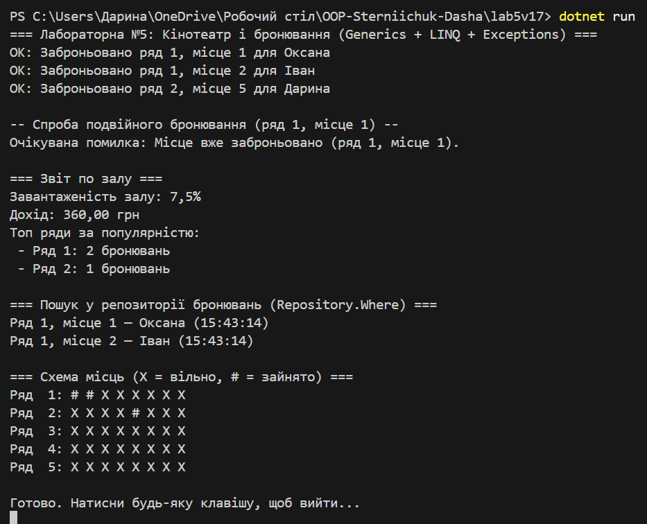

# Lab5v17 — Кінотеатр і бронювання

**Тема:** Generics, колекції, LINQ, обробка винятків.  
**Варіант 17 (бонус):** Кінотеатр/Зал/Бронювання.

## Модель
- Композиція: `Hall` містить схему місць (`Matrix<bool>`) і список `SeatReservation`.
- Generics: `Repository<T>` для зберігання бронювань; `Matrix<T>` для схеми місць.
- Винятки: `SeatAlreadyBookedException`, `InvalidSeatException`.
- Обчислення/LINQ: завантаженість, дохід, топ-ряди за популярністю.

## Запуск
